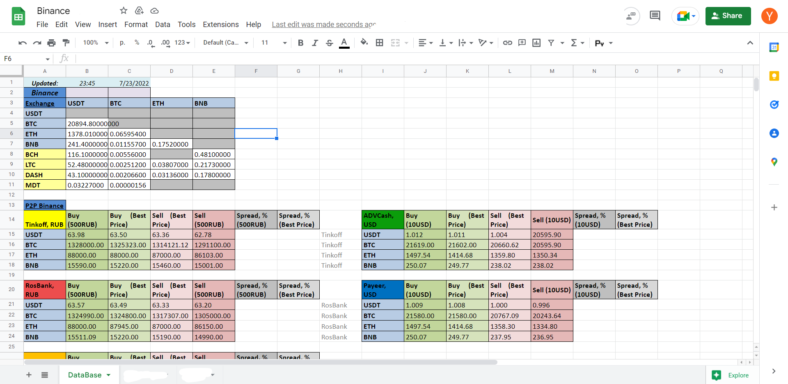

# Binance P2P alternative API 

A python Module to scrape Binance P2P data from https://p2p.binance.com/  into Google Sheets 

If you're interested in getting the module or a costume service, please contact me through Rhzif@hotmail.com  or Telegram @yassindev01

# Получение данных Binance P2P, поддерживаются Excel и Jupyter 

Модуль python для соскабливания данных Binance P2P с сайта https://p2p.binance.com/. to Google Sheets.

Если вы заинтересованы в получении модуля или услуги, пожалуйста, свяжитесь со мной через Rhzif@hotmail.com or Telegram @yassindev01

 

